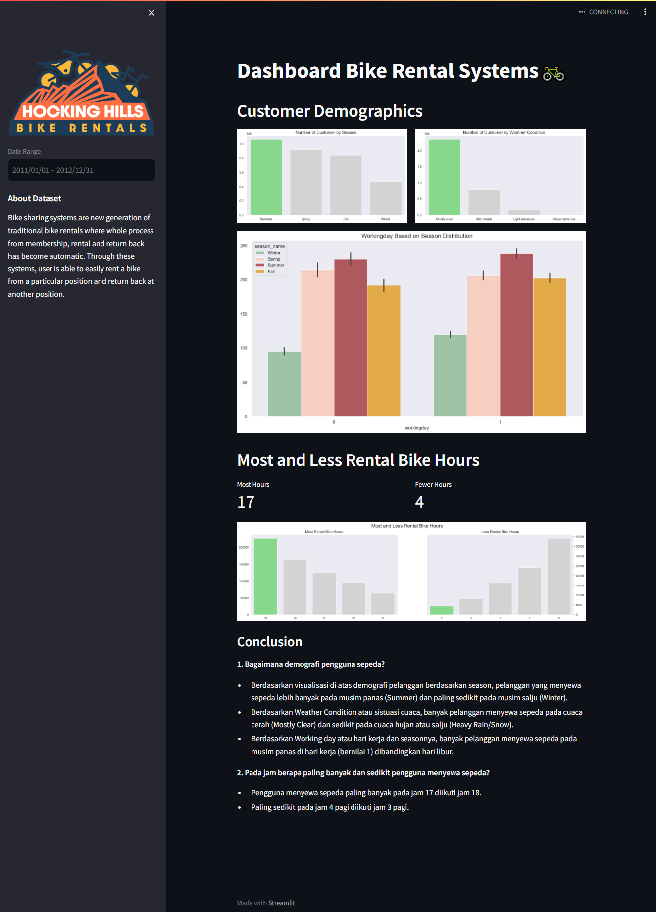

# Dashboard Bike Rental Systems🚲

## Setup environment

```
conda create --name myvenv python=3.9
conda activate base
pip install pandas matplotlib seaborn jupyter streamlit
```

## Run steamlit app

```
streamlit run dashboard.py
```

## Dashboard View


